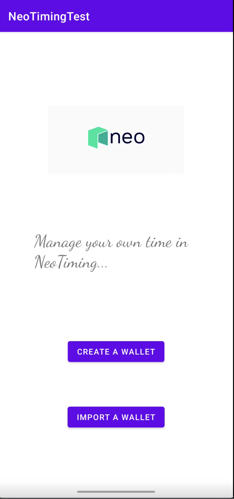

# NEO-Timing

# Introduction
This repository contains a DApp named Neo Timing, which is a time management App. The front end is a Android App.

The smart contract is in the `contract` directory. It has been deployed to the N3 Testnet, whose contract address is `0x4b4ad9f2db73806f241ce0d0a16bd34d769f3501`. You can check this contract in the [blockchain browser](https://neo3.neotube.io/).

## Client Install
The Android App is in the `Application_SDK_GUI` directory. To compile the App, Android Studio is required.

## Demo

